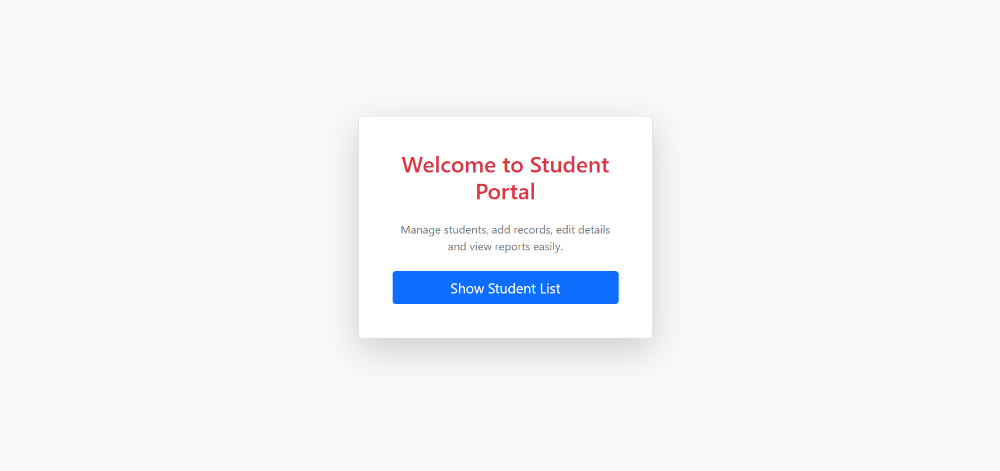

## 🎓 Student Management System - Spring MVC

A full-stack web-based Student Management System built using Spring MVC, JSP, and JPA/Hibernate.  
The application allows users to perform complete CRUD operations with pagination support and a clean Bootstrap-based user interface.

---

## 📌 Project Overview

This project demonstrates the implementation of the MVC (Model-View-Controller) architecture using Spring MVC.  
It provides a structured way to manage student records including adding, editing, deleting, and viewing students in a paginated format.

The application is deployed on Apache Tomcat and follows best practices for layered architecture and clean UI design.

---

## 🚀 Features

- ➕ Add New Student

- ✏ Edit Student Details

- ❌ Delete Student

- 📋 View Student List

- 📄 Pagination Support

- 🎨 Responsive Bootstrap UI

- 🏗 MVC Architecture Implementation

- 🔄 Form Handling and Data Binding

---

## 🛠 Tech Stack

**Backend**
- Java
- Spring MVC
- JPA / Hibernate

**Frontend**
- JSP
- HTML5
- CSS3
- Bootstrap

**Database**
- MySQL

**Server**
- Apache Tomcat

**Build Tool**
- Maven

---

## 🏗 Architecture

The project follows the MVC design pattern:

- **Model** → Student Entity and Database Layer  
- **Controller** → Handles HTTP Requests and Business Logic  
- **View** → JSP Pages for UI Rendering  

This separation ensures clean code structure and maintainability.

---

## 📂 Project Structure

src/

├── controller/

├── service/

├── repository/

├── model/

└── webapp/

└── WEB-INF/

└── views/

---

## 📸 Screens Included

- Home Page
- Add Student Page
- Edit Student Page
- Student List with Pagination

  ## 📸 Output Screenshots

  # Welcome Page:

---

## 🎯 Learning Outcomes

- Understanding of Spring MVC workflow
- Form handling and data binding
- Implementing pagination using Spring Data
- Integration of JSP with backend controller
- Clean UI design using Bootstrap

---

---

## 🔮 Future Enhancements

- 🔐 Implement User Authentication & Role-Based Authorization (Admin/User)
- 🔎 Add Search and Filtering functionality
- 📊 Add Sorting (Name, Course, Fees, etc.)
- 📤 Export student data to PDF / Excel
- 🌐 Convert the application into REST APIs
- ⚡ Migrate to Spring Boot for simplified configuration
- 🧪 Add Unit and Integration Testing
- 📱 Improve UI with modern frontend frameworks (React / Angular)
- 🗄 Add Soft Delete functionality
- ☁ Deploy on cloud platforms (AWS / Azure)

---

## 👩‍💻 Author

**Chaitali Shende**  
Aspiring Java Developer | Spring MVC Enthusiast
